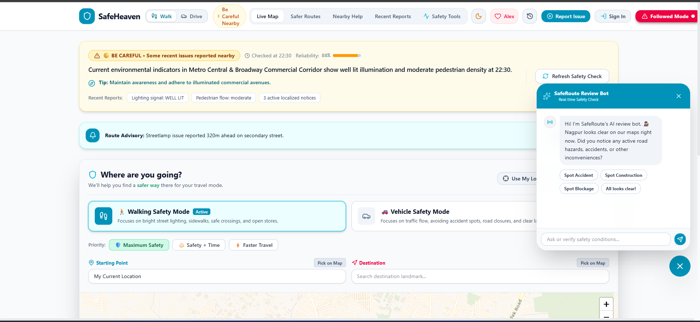
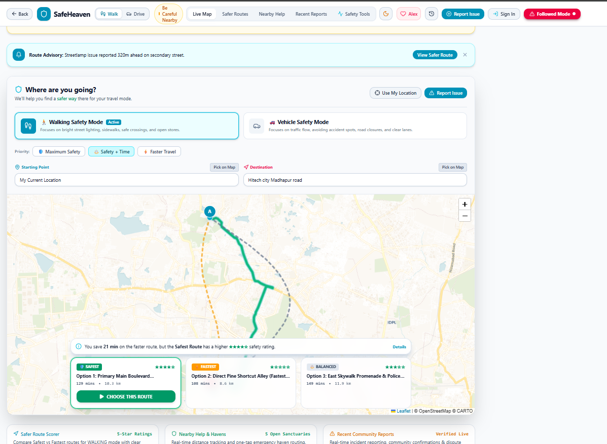
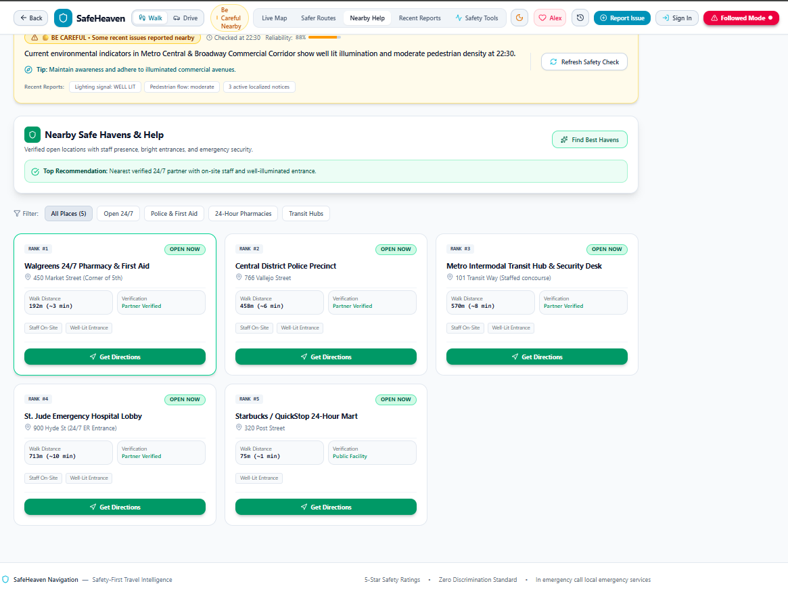

# 🛡️ SafeRoute

### Real-Time Safety Navigation & Emergency Assistance

SafeRoute is a safety-aware navigation platform that helps users make informed travel decisions using **real-time location, route information, community reports, safety intelligence, Safe Havens, and emergency assistance**.

> **Navigate smarter. Travel safer.**

---

## 🌐 Live Demo

**Website:** `https://YOUR-DOMAIN-HERE`

---

## 📸 Screenshots

### 🏠 Dashboard



### 🗺️ Live Safety Map



### 🆘 Help & Emergency



---

## ✨ Features

### 📍 Current Location
- Real-time GPS location
- High-accuracy positioning
- Location permission handling
- Manual location fallback
- Continuous GPS tracking

### 🗺️ Safety-Aware Navigation
Routes can consider:

- 🚗 Accidents
- 🚧 Construction
- 🚫 Road blockages
- ⚠️ Safety reports
- 💡 Infrastructure issues
- 🏪 Safe Havens
- 🕒 Time-based signals

Users can compare routes using both **travel time and available safety signals**.

### 🚨 Incident Reporting
Authenticated users can report:

- Accidents
- Construction
- Road blockages
- Harassment
- Suspicious activity
- Fire
- Medical emergencies
- Infrastructure problems

Reports can include location, description, timestamp, and photo evidence where appropriate.

### 📸 Evidence
Incident categories are matched correctly with their reports.

Example:

```text
Accident → Accident
Construction → Construction
Road Blockage → Road Blockage
```

Sensitive reports should never require users to photograph people or put themselves in danger.

### 🤖 Safety Review Bot
Users who recently passed through an area can provide an independent observation:

```text
🚗 Accident
🚧 Construction
🚫 Road blockage
⚠️ Safety issue
✅ Nothing unusual
❓ Not sure
```

This helps improve incident confidence and reduce false reports.

### 🧠 Live Safety Pulse
Shows current available safety signals instead of permanently labeling an area as safe or dangerous.

```text
🟡 Caution

2 recent reports
1 recent incident
3 nearby Safe Havens

Confidence: Medium
```

### 🏪 Safe Havens
Shows verified nearby locations such as:

- Pharmacies
- Convenience stores
- Fuel stations
- Late-night businesses

### 🆘 Emergency Assistance
Includes emergency-oriented features such as:

- SOS
- Emergency calling
- Trusted contacts
- Live location sharing
- Emergency messages
- Nearby emergency facilities
- "I'm being followed" flow

### 👥 Trusted Circle
Users can share their:

- Location
- Route
- ETA
- Safety alerts
- Emergency status

with trusted contacts.

---

## 🔐 Authentication

Firebase Authentication protects personal features.

### Public users
Can access appropriate public map and safety information.

### Signed-in users
Can access:

- Incident reporting
- Photo uploads
- Safety Review
- Trusted Circle
- Trip monitoring
- Personal data
- Location sharing
- SOS features

---

## 🔥 Backend

SafeRoute uses:

- **Firebase Authentication** — user accounts
- **Cloud Firestore** — application data
- **Firebase Storage** — incident photos
- **Gemini** — optional AI safety explanations

---

## 🗺️ Maps & Location

SafeRoute uses:

- Leaflet
- OpenStreetMap-compatible map data
- CartoDB
- Browser Geolocation API

A Google Maps API key is not required for the Leaflet map engine.

---

## 🧠 Safety Intelligence

The Safety Engine can consider:

```text
Incident Severity
       +
Incident Age
       +
Distance
       +
Verification
       +
Incident Type
       +
Route Exposure
       ↓
Safety Assessment
```

SafeRoute separates:

- **Risk**
- **Confidence**
- **Data Coverage**

No recent reports does **not** mean a location is guaranteed safe.

---

## 🔄 Verification

A report follows a lifecycle:

```text
Report
  ↓
Pending
  ↓
Verification
  ↓
Verified / Disputed
  ↓
Resolved / Expired
```

A single unverified report should not automatically label an area as dangerous.

---

## 🤖 Responsible AI

AI can explain structured safety information but must not invent:

- Incidents
- Statistics
- Locations
- Verification counts
- Safety scores

When reliable information is unavailable, SafeRoute should communicate:

> **Limited safety data available**

---

## 🛡️ Privacy & Security

SafeRoute follows a privacy-first approach.

- Personal location is protected.
- Trusted contacts are private.
- Personal trip data is protected.
- Reporter identity should not be unnecessarily exposed.
- Backend security rules protect sensitive operations.
- Secrets must never be committed to GitHub.

---

## 🧰 Tech Stack

| Layer | Technology |
|---|---|
| Frontend | React + TypeScript |
| Maps | Leaflet |
| Location | Browser Geolocation API |
| Authentication | Firebase Auth |
| Database | Cloud Firestore |
| Storage | Firebase Storage |
| AI | Gemini |
| Routing | Routing provider abstraction |

---

## 📁 Project Structure

```text
SafeRoute/
├── screenshots/
│   ├── dashboard.png
│   ├── Live_map.png
│   └── Help.png
├── src/
├── functions/
├── firestore.rules
├── firebase.json
├── package.json
├── .env.example
└── README.md
```

---

## 💻 Run Locally

### Install dependencies

```bash
npm install
```

### Start development server

```bash
npm run dev
```

Open the URL shown in the terminal.

### Production build

```bash
npm run build
```

---

## ⚙️ Environment Variables

Only add the variables required by your deployment.

Example:

```env
GEMINI_API_KEY=
OPENROUTESERVICE_API_KEY=
```

Never commit private API keys, passwords, tokens, or Firebase service-account credentials.

---

## 🚀 Deployment (Render)

SafeRoute is deployed as **one Render Web Service** combining the React frontend and Express API server.

```text
Render Web Service
 └── SafeRoute (React Frontend + Express API)
          ↓
      Firebase (Auth, Firestore, Storage, Functions)
```

### Render Deployment Configuration

- **Build Command:** `npm install && npm run build`
- **Start Command:** `npm start`
- **Node Version:** Node 20+

### Environment Variables

#### Server-side (Render Environment Variables)
```env
PORT=10000
NODE_ENV=production
GEMINI_API_KEY=your_gemini_api_key
```

#### Client-side (Exposed to Vite Build)
```env
VITE_FIREBASE_API_KEY=your_firebase_api_key
VITE_FIREBASE_AUTH_DOMAIN=your_project.firebaseapp.com
VITE_FIREBASE_PROJECT_ID=your_project_id
VITE_FIREBASE_STORAGE_BUCKET=your_project.appspot.com
VITE_FIREBASE_MESSAGING_SENDER_ID=your_messaging_sender_id
VITE_FIREBASE_APP_ID=your_app_id
```

---

## ⚠️ Limitations

SafeRoute depends on available real-world data.

- Community reports may be incorrect.
- Public data may be delayed.
- GPS accuracy varies by device.
- Not every location has live incident data.
- No reports does not guarantee safety.
- Emergency features depend on device and network support.

SafeRoute is a decision-support tool and does not guarantee personal safety.

---

## 🛣️ Roadmap

- [x] Interactive map
- [x] Current location
- [x] GPS tracking
- [x] Firebase authentication
- [x] Firestore integration
- [x] Incident reporting
- [x] Safe Havens
- [ ] Advanced safety scoring
- [ ] Review Bot
- [ ] Community verification
- [ ] Public road/construction data
- [ ] Advanced SOS
- [ ] Production monitoring
- [ ] PWA/mobile optimization

---

## 🎯 Vision

Traditional navigation asks:

> **"What is the fastest route?"**

SafeRoute asks:

> **"What is happening around my route right now?"**

The vision is to combine **navigation + real-time safety intelligence + community verification + emergency assistance** into one platform.

---

# 🛡️ SafeRoute

### Navigate smarter. Travel safer.
